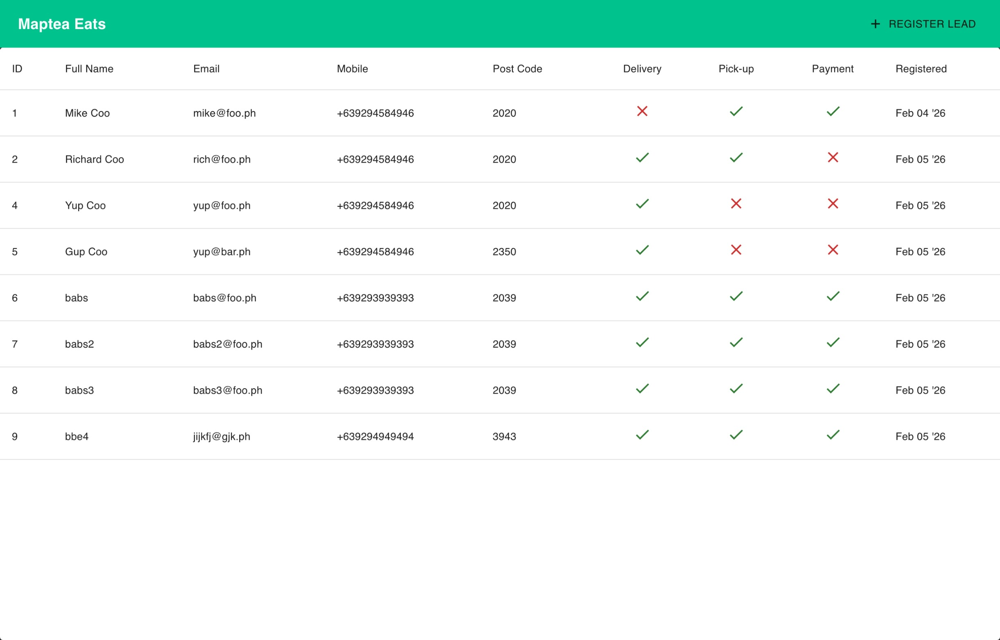
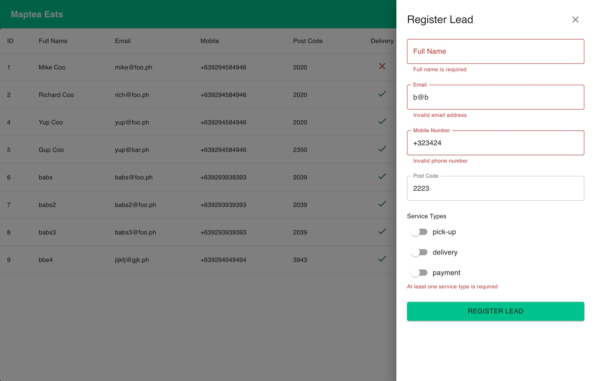

# # Maptea Backend Assessment

- This is a simple GraphQL frontend for the [Maptea Assessment Backend](https://github.com/myknbani/maptea-stealth-backend-second-application)
- Hosted at https://maptea-stealth-frontend.netlify.app/

## Getting Started

1. Clone the repository

```sh
# SSH
git clone git@github.com:myknbani/maptea-stealth-assessment-frontend-second-application.git

# HTTPS
git clone https://github.com/myknbani/maptea-stealth-assessment-frontend-second-application.git
```

2. Add `.env` file in the root of the project with the following content:

```sh
# THis is the default port when running locally
VITE_GRAPHQL_ENDPOINT=http://localhost:3001/graphql
```

3. Install dependencies

```sh
npm install
```

4. Start the development server

```sh
npm run dev
```

5. Open your browser and navigate to `http://localhost:5173` to see the application in action.

## Screenshots



